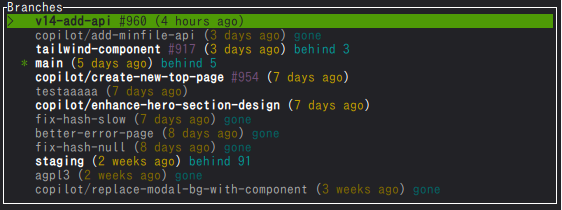

# git-checkoutui

View a list of git branches and select and checkout them.

```sh
git checkoutui
```



Feel free to set your own aliases in .gitconfig and use them.

```ini
[alias]
ct = checkoutui
```

```sh
git ct
```
